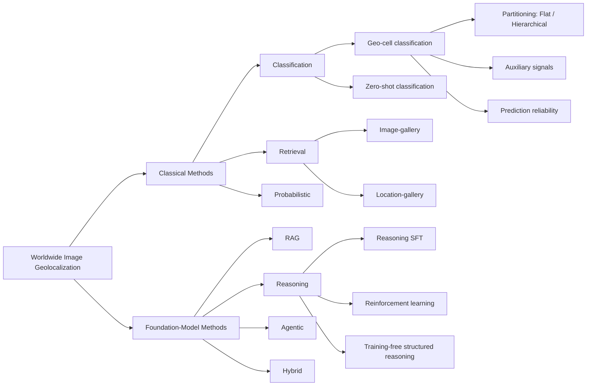
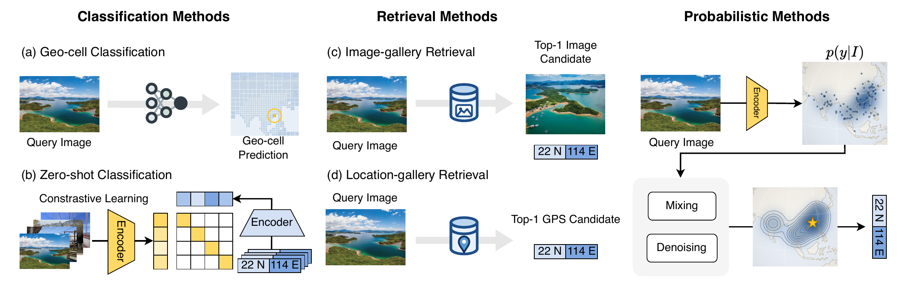
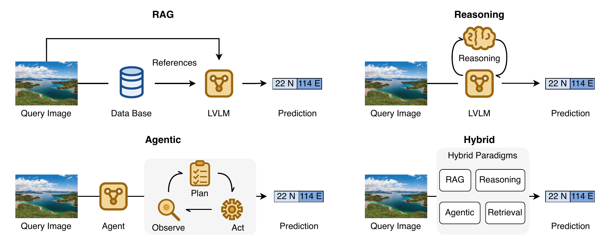

# Awesome Worldwide Image Geolocalization

A curated list of papers, datasets, and benchmarks for **worldwide image geolocalization**: predicting the geographic location of an image taken anywhere on Earth, expressed as GPS coordinates, a geographic cell, or an administrative region. The task is open-world by nature: no reference collection provides complete imagery coverage of the planet, so a model must generalize to locations it has never observed.

This repository accompanies our survey [**"Worldwide Image Geolocalization in the Foundation Model Era: A Survey"**](https://www.preprints.org/manuscript/202608.1749) and follows its taxonomy. 

## Contents

- [Taxonomy](#taxonomy)
- [Classical Methods](#classical-methods)
  - [Classification](#classification)
  - [Retrieval](#retrieval)
  - [Probabilistic](#probabilistic)
- [Foundation-Model Methods](#foundation-model-methods)
  - [RAG](#rag)
  - [Reasoning](#reasoning)
  - [Agentic](#agentic)
  - [Hybrid](#hybrid)
- [Datasets](#datasets)
- [Benchmarks](#benchmarks)
- [Performance Summary](#performance-summary)
- [Related Surveys](#related-surveys)
- [Contributing](#contributing)

## Taxonomy

We organize existing studies into two broad groups. **Classical methods** mainly differ in how they represent and predict geographic locations: classification-based methods divide the Earth into discrete geographic classes, retrieval-based methods infer locations by searching over geo-tagged references or location representations, and probabilistic methods estimate a distribution over possible locations. **Foundation-model methods** are organized by how foundation models are used in the geolocalization process: retrieval-augmented generation (RAG), reasoning, agentic, and hybrid designs.

## Classical Methods

### Classification

| Method | Sub-category | Paper | Venue | Year |
|---|---|---|---|---|
| **PlaNet** | Flat partitioning | [PlaNet: Photo geolocation with convolutional neural networks](https://arxiv.org/abs/1602.05314) | ECCV | 2016 |
| **CPlaNet** | Flat partitioning | [CPlaNet: Enhancing image geolocalization by combinatorial partitioning of maps](https://arxiv.org/abs/1808.02130) | ECCV | 2018 |
| **ISNs** | Hierarchical partitioning | [Geolocation estimation of photos using a hierarchical model and scene classification](https://link.springer.com/chapter/10.1007/978-3-030-01258-8_35) | ECCV | 2018 |
| **SemP** | Hierarchical partitioning | [Interpretable semantic photo geolocation](https://arxiv.org/abs/2104.14995) | WACV | 2022 |
| **GeoDecoder** | Hierarchical partitioning | [Where we are and what we're looking at: Query based worldwide image geo-localization using hierarchies and scenes](https://arxiv.org/abs/2303.04249) | CVPR | 2023 |
| **PIGEON** | Hierarchical partitioning | [PIGEON: Predicting image geolocations](https://arxiv.org/abs/2307.05845) | CVPR | 2024 |
| **TransLocator** | Auxiliary signals | [Where in the world is this image? transformer-based geo-localization in the wild](https://arxiv.org/abs/2204.13861) | ECCV | 2022 |
| **Bianco et al.** | Auxiliary signals | [Enhancing worldwide image geolocation by ensembling satellite-based ground-level attribute predictors](https://arxiv.org/abs/2407.13862) | WACV | 2025 |
| **SelectivePred** | Prediction reliability | [Leveraging selective prediction for reliable image geolocation](https://arxiv.org/abs/2111.11952) | MMM | 2022 |
| **StreetCLIP** | Zero-shot classification | [Learning generalized zero-shot learners for open-domain image geolocalization](https://arxiv.org/abs/2302.00275) | arXiv | 2023 |
| **GEM** | Zero-shot classification | [Im2City: Image geo-localization via multi-modal learning](https://dl.acm.org/doi/10.1145/3557918.3565868) | SIGSPATIAL | 2022 |

### Retrieval

| Method | Sub-category | Paper | Venue | Year |
|---|---|---|---|---|
| **IM2GPS** | Image-gallery | [IM2GPS: estimating geographic information from a single image](https://ieeexplore.ieee.org/document/4587784/) | CVPR | 2008 |
| **IM2GPS-ext** | Image-gallery | [Large-scale image geolocalization](https://link.springer.com/chapter/10.1007/978-3-319-09861-6_3) | Springer (book chapter) | 2014 |
| **GeoCLIP** | Location-gallery | [GeoCLIP: Clip-inspired alignment between locations and images for effective worldwide geo-localization](https://arxiv.org/abs/2309.16020) | NeurIPS | 2023 |
| **Chen2025-SemiVar** | Location-gallery | [Enhancing Contrastive Learning for Geolocalization by Discovering Hard Negatives on Semivariograms](https://arxiv.org/abs/2509.21573) | SIGSPATIAL | 2025 |
| **Concept-Aware** | Location-gallery | [Towards Interpretable Geo-localization: a Concept-Aware Global Image-GPS Alignment Framework](https://arxiv.org/abs/2509.01910) | arXiv | 2025 |
| **GT-Loc** | Location-gallery | [GT-Loc: Unifying when and where in images through a joint embedding space](https://arxiv.org/abs/2507.10473) | ICCV | 2025 |
| **HierLoc** | Location-gallery | [HierLoc: Hyperbolic Entity Embeddings for Hierarchical Visual Geolocation](https://arxiv.org/abs/2601.23064) | ICLR | 2026 |
| **GeoSURGE** | Location-gallery | [GeoSURGE: Geo-localization using Semantic Fusion with Hierarchy of Geographic Embeddings](https://arxiv.org/abs/2510.01448) | CVPR | 2026 |
| **Pinpoint** | Location-gallery | [Pinpoint: Grounded Worldwide Image Geolocation via Cross-Source Retrieval and Reranking](https://arxiv.org/abs/2606.04133) | arXiv | 2026 |

### Probabilistic

| Method | Paper | Venue | Year |
|---|---|---|---|
| **MvMF** | [Exploiting the earth’s spherical geometry to geolocate images](https://doi.org/10.1007/978-3-030-46147-8_1) | ECML-PKDD | 2019 |
| **SwC** | [Leveraging efficientnet and contrastive learning for accurate global-scale location estimation](https://arxiv.org/abs/2105.07645) | ICMR | 2021 |
| **PLONK** | [Around the world in 80 timesteps: A generative approach to global visual geolocation](https://arxiv.org/abs/2412.06781) | CVPR | 2025 |
| **LocDiff** | [LocDiff: Identifying Locations on Earth by Diffusing in the Hilbert Space](https://arxiv.org/abs/2503.18142) | NeurIPS | 2026 |

## Foundation-Model Methods

### RAG

| Method | Paper | Venue | Year |
|---|---|---|---|
| **Img2Loc** | [Img2Loc: Revisiting image geolocalization using multi-modality foundation models and image-based retrieval-augmented generation](https://arxiv.org/abs/2403.19584) | SIGIR | 2024 |
| **G3** | [G3: an effective and adaptive framework for worldwide geolocalization using large multi-modality models](https://arxiv.org/abs/2405.14702) | NeurIPS | 2024 |
| **GeoToken** | [GeoToken: Hierarchical Geolocalization of Images via Next Token Prediction](https://arxiv.org/abs/2511.01082) | ICDM | 2025 |
| **GeoSearch** | [GeoSearch: Augmenting Worldwide Geolocalization with Web-Scale Reverse Image Search and Image Matching](https://arxiv.org/abs/2604.25390) | SIGIR | 2026 |
| **DualGeo** | [DualGeo: A Dual-View Framework for Worldwide Image Geo-localization](https://arxiv.org/abs/2604.25533) | ICME | 2026 |
| **TransGeoCLIP** | [When Vision Misleads, Let Location Speak: A Worldwide Image Geo-Localization Method via Location Attention Mechanism and Large Multimodal Models](https://arxiv.org/abs/2606.08918) | arXiv | 2026 |

### Reasoning

| Method | Sub-category | Paper | Venue | Year |
|---|---|---|---|---|
| **GAEA** | Reasoning SFT | [GAEA: A geolocation aware conversational assistant](https://arxiv.org/abs/2503.16423) | WACV | 2026 |
| **GaGA** | Reasoning SFT | [GaGA: Towards interactive global geolocation assistant](https://arxiv.org/abs/2412.08907) | arXiv | 2024 |
| **ETHAN** | Reasoning SFT | [Image-based geolocation using large vision-language models](https://arxiv.org/abs/2408.09474) | arXiv | 2024 |
| **GeoLocSFT** | Reasoning SFT | [GeoLocSFT: Efficient visual geolocation via supervised fine-tuning of multimodal foundation models](https://arxiv.org/abs/2506.01277) | arXiv | 2025 |
| **GeoReasoner** | Reasoning SFT | [GeoReasoner: Geo-localization with reasoning in street views using a large vision-language model](https://arxiv.org/abs/2406.18572) | ICML | 2024 |
| **GLOBE** | Reinforcement learning | [Recognition through reasoning: Reinforcing image geo-localization with large vision-language models](https://arxiv.org/abs/2506.14674) | NeurIPS | 2026 |
| **GeoAgent** | Reinforcement learning | [GeoAgent: Learning to geolocate everywhere with reinforced geographic characteristics](https://arxiv.org/abs/2602.12617) | CVPR | 2026 |
| **Geo-R** | Reinforcement learning | [Vision-Language Reasoning for Geolocalization: A Reinforcement Learning Approach](https://arxiv.org/abs/2601.00388) | AAAI | 2026 |
| **Geo-ADAPT** | Reinforcement learning | [Locatability-Guided Adaptive Reasoning for Image Geo-Localization with Vision-Language Models](https://arxiv.org/abs/2603.13628) | arXiv | 2026 |
| **GRE Suite** | Reinforcement learning | [Gre suite: Geo-localization inference via fine-tuned vision-language models and enhanced reasoning chains](https://arxiv.org/abs/2505.18700) | NeurIPS | 2026 |
| **GeoBayes** | Training-free structured reasoning | [GeoBayes: Probabilistic Image Geo-Localization Inference via Sequential Bayesian Updating](https://ojs.aaai.org/index.php/AAAI/article/view/37855) | AAAI | 2026 |

### Agentic

| Method | Paper | Venue | Year |
|---|---|---|---|
| **Thinking-with-Map** | [Thinking with Map: Reinforced Parallel Map-Augmented Agent for Geolocalization](https://arxiv.org/abs/2601.05432) | arXiv | 2026 |
| **SpotAgent** | [SpotAgent: Grounding visual geo-localization in large vision-language models through agentic reasoning](https://arxiv.org/abs/2602.09463) | arXiv | 2026 |
| **LocationAgent** | [LocationAgent: A Hierarchical Agent for Image Geolocation via Decoupling Strategy and Evidence from Parametric Knowledge](https://arxiv.org/abs/2601.19155) | arXiv | 2026 |
| **GeoVista** | [GeoVista: Web-Augmented Agentic Visual Reasoning for Geolocalization](https://arxiv.org/abs/2511.15705) | arXiv | 2025 |
| **smileGeo** | [Swarm intelligence in geo-localization: A multi-agent large vision-language model collaborative framework](https://arxiv.org/abs/2408.11312) | KDD | 2025 |

### Hybrid

| Method | Paper | Venue | Year |
|---|---|---|---|
| **NAVIG** | [NAVIG: Natural language-guided analysis with vision language models for image geo-localization](https://arxiv.org/abs/2502.14638) | arXiv | 2025 |
| **GeoMR** | [GeoMR: Integrating Image Geographic Features and Human Reasoning Knowledge for Image Geolocalization](https://doi.org/10.1016/j.knosys.2026.115391) | Knowledge-Based Systems | 2026 |
| **GeoRanker** | [GeoRanker: Distance-aware ranking for worldwide image geolocalization](https://arxiv.org/abs/2505.13731) | NeurIPS | 2026 |
| **GeoRouter** | [GeoRouter: Dynamic Paradigm Routing for Worldwide Image Geolocalization](https://arxiv.org/abs/2603.24376) | arXiv | 2026 |
| **VLM-VPR** | [VLM-Guided Visual Place Recognition for Planet-Scale Geo-Localization](https://arxiv.org/abs/2507.17455) | arXiv | 2025 |

## Datasets

Datasets commonly used for training and evaluation in worldwide image geolocalization, ordered by the year they were introduced. *Usage* indicates whether a dataset is used for training, testing, or both.

| Dataset | Year | Images | Source | Annotation | Usage | Availability |
|---|---|---|---|---|---|---|
| [IM2GPS](https://ieeexplore.ieee.org/document/4587784/) | 2008 | 237 | Flickr | GPS | Test | [Link](https://graphics.cs.cmu.edu/projects/im2gps/) |
| [MP-16](https://doi.org/10.1109/MMUL.2017.9) | 2016 | 4.72M | Flickr (YFCC100M) | GPS | Train | [Link](https://huggingface.co/datasets/Jia-py/MP16-Pro) |
| [IM2GPS3k](https://arxiv.org/abs/1705.04838) | 2017 | 3K | Flickr | GPS | Test | [Metadata](https://huggingface.co/Jia-py/G3-checkpoint/tree/main), [Image](https://www.mediafire.com/file/7ht7sn78q27o9we/im2gps3ktest.zip) |
| [YFCC4k](https://arxiv.org/abs/1705.04838) | 2017 | 4K | Flickr (YFCC100M) | GPS | Test | [Metadata](https://huggingface.co/Jia-py/G3-checkpoint/tree/main), [Image](https://www.mediafire.com/file/3og8y3o6c9de3ye/yfcc4k.zip) |
| [YFCC26k](https://link.springer.com/chapter/10.1007/978-3-030-01258-8_35) | 2018 | 25,600 | Flickr (YFCC100M) | GPS | Test | [Link](https://github.com/TIBHannover/GeoEstimation) |
| [GWS15k](https://arxiv.org/abs/2303.04249) | 2023 | 14,955 | Google Street View | GPS | Test | Not released |
| [OSV-5M](https://arxiv.org/abs/2404.18873) | 2024 | 5.1M | Mapillary street view | GPS + admin | Both | [Link](https://huggingface.co/datasets/osv5m/osv5m) |
| [MP16-Pro](https://arxiv.org/abs/2405.14702) | 2024 | 4.72M | Flickr (MP-16) + text | GPS + text | Train | [Link](https://huggingface.co/datasets/Jia-py/MP16-Pro) |
| [GeoBench](https://arxiv.org/abs/2511.15705) | 2025 | 1,142 | Photos, panoramas, satellite | GPS + admin | Test | [Link](https://huggingface.co/datasets/LibraTree/GeoVistaBench) |
| [MP-Caption](https://doi.org/10.1016/j.knosys.2026.115391) | 2026 | 4.12M | Flickr (MP16-Pro) | GPS + text | Train | On request |

## Benchmarks

Benchmarks used to evaluate worldwide image geolocalization methods, ordered by the year they were introduced. *Evaluation Focus* is summarized with keywords.

| Benchmark | Year | Source | Evaluation Focus |
|---|---|---|---|
| [Deep VG Benchmark](https://arxiv.org/abs/2204.03444) | 2022 | Existing datasets | Accuracy, Efficiency |
| [CityBench](https://arxiv.org/abs/2406.13945) | 2024 | Simulator | Urban world model |
| [LLMGeo](https://arxiv.org/abs/2405.20363) | 2024 | Street View | Accuracy |
| [Charting New Territories](https://arxiv.org/abs/2311.14656) | 2024 | Web images, Maps | Geospatial capabilities |
| [WikiTiLo](https://arxiv.org/abs/2307.06166) | 2024 | Wikimedia | Reasoning |
| [Search-based Geo Study](https://arxiv.org/abs/2401.10184) | 2024 | Web images | Human search behavior |
| [Geo-Risk Assessment](https://arxiv.org/abs/2508.19967) | 2025 | Existing datasets | Accuracy, Privacy |
| [FairLocator](https://arxiv.org/abs/2502.11163) | 2025 | Street View | Bias, Privacy |
| [GSV Global Benchmark](https://arxiv.org/abs/2502.14412) | 2025 | Street View | Accuracy, Privacy, Tool use |
| [IMAGEO-Bench](https://arxiv.org/abs/2508.01608) | 2025 | Street View, Web images | Accuracy, Reasoning, Bias |
| [EarthWhere](https://arxiv.org/abs/2510.10880) | 2025 | Street View, Web images | Accuracy, Reasoning, Tool use |
| [KoreaGEO Bench](https://arxiv.org/abs/2506.03371) | 2025 | Street View | Bias, Privacy |
| [GeoChain](https://arxiv.org/abs/2506.00785) | 2025 | Street View | Reasoning |
| [MLLM Geo Evaluation](https://arxiv.org/abs/2506.23481) | 2025 | Street View | Accuracy, Privacy |
| [GeoBrowse](https://arxiv.org/abs/2604.04017) | 2026 | Web videos, Wikipedia | Reasoning, Tool use |
| [GeoArena](https://arxiv.org/abs/2509.04334) | 2026 | Web images | Reasoning, Human preference |
| [GeoRC](https://arxiv.org/abs/2601.21278) | 2026 | GeoGuessr | Reasoning |
| [ERGeoBench](https://arxiv.org/abs/2605.31251) | 2026 | Street View | Accuracy, Reasoning, Embodied |

## Performance Summary

The tables below collect the threshold accuracy (%) reported in existing papers on four representative benchmarks. For each method, we report the paradigm assigned under our taxonomy, the publication year, and accuracy at five standard distance thresholds (1 km, 25 km, 200 km, 750 km, and 2500 km). **Bold** marks the best result in each column, *italic* marks the second best, and "-" indicates that the value is not reported. Because these numbers are copied from the papers rather than reproduced under one controlled protocol, differences in training data, backbone models, and evaluation setups also contribute to the gaps between methods.

### IM2GPS3k

Note that GeoSearch uses OSV-5M as its retrieval source, and the results of PlaNet are reproduced values reported in the CPlaNet paper.

| Method | Paradigm | Year | @1km | @25km | @200km | @750km | @2500km |
|---|---|---|---|---|---|---|---|
| [PlaNet](https://arxiv.org/abs/1602.05314) | Classification | 2016 | 8.5 | 24.8 | 34.3 | 48.4 | 64.6 |
| [CPlaNet](https://arxiv.org/abs/1808.02130) | Classification | 2018 | 10.2 | 26.5 | 34.6 | 48.6 | 64.6 |
| [ISNs](https://link.springer.com/chapter/10.1007/978-3-030-01258-8_35) | Classification | 2018 | 10.5 | 28.0 | 36.6 | 49.7 | 66.0 |
| [SwC](https://arxiv.org/abs/2105.07645) | Probabilistic | 2021 | 15.0 | 30.0 | 38.0 | 52.3 | 67.6 |
| [StreetCLIP](https://arxiv.org/abs/2302.00275) | Classification | 2023 | - | 22.4 | 37.4 | 61.3 | 80.4 |
| [GeoDecoder](https://arxiv.org/abs/2303.04249) | Classification | 2023 | 12.8 | 33.5 | 45.9 | 61.0 | 76.1 |
| [TransLocator](https://arxiv.org/abs/2204.13861) | Classification | 2022 | 11.8 | 31.1 | 46.7 | 58.9 | 80.1 |
| [GeoLocSFT](https://arxiv.org/abs/2506.01277) | Reasoning | 2025 | 8.8 | 32.7 | 47.2 | 65.8 | 82.3 |
| [GaGA](https://arxiv.org/abs/2412.08907) | Reasoning | 2024 | 11.7 | 33.0 | 48.0 | 67.1 | 82.1 |
| [NAVIG](https://arxiv.org/abs/2502.14638) | Hybrid | 2025 | 5.5 | 28.9 | 49.1 | 68.3 | 84.0 |
| [Concept-Aware](https://arxiv.org/abs/2509.01910) | Retrieval | 2025 | 13.2 | 34.0 | 49.8 | 68.2 | 83.5 |
| [GeoCLIP](https://arxiv.org/abs/2309.16020) | Retrieval | 2023 | 14.1 | 34.5 | 50.7 | 69.7 | 83.8 |
| [GRE Suite](https://arxiv.org/abs/2505.18700) | Reasoning | 2025 | 11.3 | 35.3 | 51.7 | 69.3 | 85.7 |
| [LocDiff](https://arxiv.org/abs/2503.18142) | Probabilistic | 2025 | 10.9 | 34.0 | 53.3 | 72.5 | 85.2 |
| [GeoBayes](https://ojs.aaai.org/index.php/AAAI/article/view/37855) | Reasoning | 2026 | 6.3 | 34.7 | 53.6 | 73.7 | 85.9 |
| [PIGEOTTO](https://arxiv.org/abs/2307.05845) | Classification | 2024 | 11.3 | 36.7 | 53.8 | 72.4 | 85.3 |
| [GeoToken (MLLM-free)](https://arxiv.org/abs/2511.01082) | RAG | 2025 | 16.8 | 39.6 | 53.8 | 70.8 | 85.0 |
| [GLOBE](https://arxiv.org/abs/2506.14674) | Reasoning | 2025 | 9.8 | 40.2 | 56.2 | 71.5 | 82.4 |
| [G3](https://arxiv.org/abs/2405.14702) | RAG | 2024 | 16.7 | 40.9 | 55.6 | 71.2 | 84.7 |
| [GAEA](https://arxiv.org/abs/2503.16423) | Reasoning | 2025 | - | 36.9 | 56.0 | 73.2 | 86.7 |
| [DualGeo](https://arxiv.org/abs/2604.25533) | RAG | 2026 | 17.3 | 41.5 | 55.8 | 71.7 | 85.1 |
| [LocDiff-H](https://arxiv.org/abs/2503.18142) | Probabilistic | 2025 | 15.3 | 36.5 | 56.4 | 75.2 | 87.4 |
| [TransGeoCLIP](https://arxiv.org/abs/2606.08918) | RAG | 2026 | 17.7 | 42.2 | 56.8 | 71.7 | 86.1 |
| [SpotAgent](https://arxiv.org/abs/2602.09463) | Agentic | 2026 | 14.1 | 40.4 | 57.8 | 73.4 | 85.8 |
| [GeoMR](https://doi.org/10.1016/j.knosys.2026.115391) | Hybrid | 2026 | 17.0 | 41.7 | 57.5 | 73.7 | 85.7 |
| [Img2Loc](https://arxiv.org/abs/2403.19584) | RAG | 2024 | 17.1 | 45.1 | 57.9 | 72.9 | 84.7 |
| [HierLoc](https://arxiv.org/abs/2601.23064) | Retrieval | 2026 | 11.3 | 43.8 | 58.4 | 74.1 | 85.1 |
| [Geo-R](https://arxiv.org/abs/2601.00388) | Reasoning | 2026 | 18.1 | 41.5 | 58.3 | 75.3 | 86.4 |
| [GeoSURGE](https://arxiv.org/abs/2510.01448) | Retrieval | 2026 | 17.2 | 42.5 | 58.1 | 74.6 | 87.6 |
| [VLM-VPR](https://arxiv.org/abs/2507.17455) | Hybrid | 2025 | 18.9 | 46.1 | 59.8 | 73.7 | 86.0 |
| [GeoAgent](https://arxiv.org/abs/2602.12617) | Reasoning | 2026 | - | 40.8 | 58.6 | 76.2 | 89.9 |
| [GeoToken (MLLM-assisted)](https://arxiv.org/abs/2511.01082) | RAG | 2025 | 19.0 | 46.0 | 60.1 | 76.6 | 88.8 |
| [GeoRanker](https://arxiv.org/abs/2505.13731) | Hybrid | 2025 | 18.8 | 45.1 | 61.5 | 76.3 | 89.3 |
| [Geo-ADAPT](https://arxiv.org/abs/2603.13628) | Reasoning | 2026 | 17.9 | 45.3 | 62.6 | 77.9 | 89.5 |
| [Pinpoint](https://arxiv.org/abs/2606.04133) | Retrieval | 2026 | 20.5 | 47.4 | 63.5 | 79.0 | *90.2* |
| [GeoRouter](https://arxiv.org/abs/2603.24376) | Hybrid | 2026 | 20.8 | 50.5 | 65.7 | **80.4** | **90.7** |
| [GeoSearch+G3](https://arxiv.org/abs/2604.25390) | RAG | 2026 | *23.5* | *54.9* | *66.9* | 79.6 | 89.4 |
| [GeoSearch+GeoRanker](https://arxiv.org/abs/2604.25390) | RAG | 2026 | **23.6** | **55.1** | **67.1** | *79.8* | 89.6 |

### YFCC4k

Note that GeoSearch uses OSV-5M as its retrieval source, and that the results of PlaNet, ISNs, and GeoCLIP are reproduced values reported in the CPlaNet, TransLocator, and G3 papers, respectively.

| Method | Paradigm | Year | @1km | @25km | @200km | @750km | @2500km |
|---|---|---|---|---|---|---|---|
| [CPlaNet](https://arxiv.org/abs/1808.02130) | Classification | 2018 | 7.9 | 14.8 | 21.9 | 36.4 | 55.5 |
| [PlaNet](https://arxiv.org/abs/1602.05314) | Classification | 2016 | 5.6 | 14.3 | 22.2 | 36.4 | 55.8 |
| [SwC](https://arxiv.org/abs/2105.07645) | Probabilistic | 2021 | 7.9 | 14.3 | 21.9 | 37.4 | 56.5 |
| [ISNs](https://link.springer.com/chapter/10.1007/978-3-030-01258-8_35) | Classification | 2018 | 6.5 | 16.2 | 23.8 | 37.4 | 55.0 |
| [TransLocator](https://arxiv.org/abs/2204.13861) | Classification | 2022 | 8.4 | 18.6 | 27.0 | 41.1 | 60.4 |
| [GeoDecoder](https://arxiv.org/abs/2303.04249) | Classification | 2023 | 10.3 | 24.4 | 33.9 | 50.0 | 68.7 |
| [GeoBayes](https://ojs.aaai.org/index.php/AAAI/article/view/37855) | Reasoning | 2026 | 4.9 | 16.1 | 30.9 | 55.8 | 75.4 |
| [GeoCLIP](https://arxiv.org/abs/2309.16020) | Retrieval | 2023 | 9.6 | 19.3 | 32.6 | 55.0 | 74.7 |
| [SpotAgent](https://arxiv.org/abs/2602.09463) | Agentic | 2026 | 7.3 | 21.5 | 36.2 | 55.0 | 70.8 |
| [PLONK](https://arxiv.org/abs/2412.06781) | Probabilistic | 2024 | - | 23.7 | 36.4 | 54.5 | 73.6 |
| [Geo-R](https://arxiv.org/abs/2601.00388) | Reasoning | 2026 | 10.5 | 22.7 | 40.0 | 60.8 | 75.8 |
| [PIGEOTTO](https://arxiv.org/abs/2307.05845) | Classification | 2024 | 10.4 | 23.7 | 40.6 | 62.2 | 77.7 |
| [Img2Loc](https://arxiv.org/abs/2403.19584) | RAG | 2024 | 14.1 | 29.6 | 41.4 | 59.3 | 76.9 |
| [HierLoc](https://arxiv.org/abs/2601.23064) | Retrieval | 2026 | 8.4 | 30.2 | 43.3 | 61.7 | 75.8 |
| [DualGeo](https://arxiv.org/abs/2604.25533) | RAG | 2026 | 27.5 | 36.5 | 45.0 | 61.6 | 75.9 |
| [GeoToken (MLLM-free)](https://arxiv.org/abs/2511.01082) | RAG | 2025 | 24.3 | 35.3 | 46.6 | 64.2 | 78.6 |
| [G3](https://arxiv.org/abs/2405.14702) | RAG | 2024 | 24.0 | 35.9 | 47.0 | 64.3 | 78.2 |
| [GeoSearch+G3](https://arxiv.org/abs/2604.25390) | RAG | 2026 | 17.5 | 35.2 | 48.2 | 63.5 | 79.9 |
| [GeoSearch+GeoRanker](https://arxiv.org/abs/2604.25390) | RAG | 2026 | 17.5 | 35.2 | 48.2 | 63.4 | 79.3 |
| [GeoSURGE](https://arxiv.org/abs/2510.01448) | Retrieval | 2026 | 19.9 | 33.6 | 48.7 | 67.4 | 82.0 |
| [GeoMR](https://doi.org/10.1016/j.knosys.2026.115391) | Hybrid | 2026 | 26.3 | 37.6 | 49.3 | 66.3 | 81.4 |
| [GeoToken (MLLM-assisted)](https://arxiv.org/abs/2511.01082) | RAG | 2025 | 25.4 | 38.5 | 51.4 | 68.0 | 81.0 |
| [TransGeoCLIP](https://arxiv.org/abs/2606.08918) | RAG | 2026 | 31.2 | 41.1 | 51.8 | 67.8 | 81.0 |
| [Geo-ADAPT](https://arxiv.org/abs/2603.13628) | Reasoning | 2026 | 32.5 | 39.1 | *55.4* | 70.8 | **84.5** |
| [GeoRanker](https://arxiv.org/abs/2505.13731) | Hybrid | 2025 | *32.9* | 43.5 | 54.3 | 69.8 | 82.5 |
| [Pinpoint](https://arxiv.org/abs/2606.04133) | Retrieval | 2026 | **33.0** | *44.4* | **57.5** | *71.8* | **84.5** |
| [GeoRouter](https://arxiv.org/abs/2603.24376) | Hybrid | 2026 | **33.0** | **46.0** | **57.5** | **72.0** | *83.0* |

### GWS15k

Note that the results of GaGA are reported on a version of GWS15k rebuilt by its authors from the OSV-5M test set, which is not identical to the original GWS15k.

| Method | Paradigm | Year | @1km | @25km | @200km | @750km | @2500km |
|---|---|---|---|---|---|---|---|
| [GeoDecoder](https://arxiv.org/abs/2303.04249) | Classification | 2023 | 0.7 | 1.5 | 8.7 | 26.9 | 50.5 |
| [GAEA](https://arxiv.org/abs/2503.16423) | Reasoning | 2025 | - | 3.7 | 16.7 | 43.3 | 73.5 |
| [GeoCLIP](https://arxiv.org/abs/2309.16020) | Retrieval | 2023 | 0.6 | 3.1 | 16.9 | 45.7 | 74.1 |
| [GRE Suite](https://arxiv.org/abs/2505.18700) | Reasoning | 2025 | 0.9 | 4.1 | 18.9 | 54.8 | 78.3 |
| [GeoSURGE](https://arxiv.org/abs/2510.01448) | Retrieval | 2026 | *1.0* | 4.6 | 21.9 | 54.7 | 80.8 |
| [GaGA](https://arxiv.org/abs/2412.08907) | Reasoning | 2024 | 0.1 | 8.5 | **33.9** | 60.6 | 82.2 |
| [PIGEOTTO](https://arxiv.org/abs/2307.05845) | Classification | 2024 | 0.7 | 9.2 | 31.2 | 65.7 | *85.1* |
| [VLM-VPR](https://arxiv.org/abs/2507.17455) | Hybrid | 2025 | 0.5 | *9.6* | 32.3 | 65.2 | **87.2** |
| [LocDiff-H](https://arxiv.org/abs/2503.18142) | Probabilistic | 2025 | 0.9 | 7.4 | 33.5 | *66.2* | 85.0 |
| [LocDiff](https://arxiv.org/abs/2503.18142) | Probabilistic | 2025 | **2.1** | **12.4** | *33.7* | **67.0** | 85.0 |

### OSV-5M

| Method | Paradigm | Year | @1km | @25km | @200km | @750km | @2500km |
|---|---|---|---|---|---|---|---|
| [GeoLocSFT](https://arxiv.org/abs/2506.01277) | Reasoning | 2025 | **2.4** | 3.5 | 15.0 | 47.2 | 69.6 |
| [Chen2025-SemiVar](https://arxiv.org/abs/2509.21573) | Retrieval | 2025 | - | *21.5* | *52.1* | 72.1 | - |
| [GaGA](https://arxiv.org/abs/2412.08907) | Reasoning | 2024 | *0.1* | 8.0 | 40.1 | 68.0 | 85.4 |
| [LocDiff](https://arxiv.org/abs/2503.18142) | Probabilistic | 2025 | - | 11.0 | 46.3 | *77.0* | *88.2* |
| [Pinpoint](https://arxiv.org/abs/2606.04133) | Retrieval | 2026 | - | **35.6** | **67.5** | **83.7** | **93.2** |

## Related Surveys

- [Visual place recognition: A survey](https://doi.org/10.1109/TRO.2015.2496823) (IEEE T-RO 2015) - Visual place recognition
- [Visual place recognition: A tutorial](https://arxiv.org/abs/2303.03281) (IEEE RA-M 2023) - Visual place recognition
- [Visual place recognition for aerial imagery: A survey](https://arxiv.org/abs/2406.00885) (Robotics and Autonomous Systems 2025) - Aerial visual place recognition
- [Cross-view geo-localization: a survey](https://arxiv.org/abs/2406.09722) (IEEE Access 2024) - Cross-view geo-localization
- [Image and object geo-localization](https://link.springer.com/article/10.1007/s11263-023-01942-3) (IJCV 2024) - Image and object geo-localization
- [Geospatial Representation Learning: A Survey from Deep Learning to The LLM Era](https://arxiv.org/abs/2505.09651) (arXiv 2025) - Geospatial representation learning
- [Towards vision-language geo-foundation model: A survey](https://arxiv.org/abs/2406.09385) (arXiv 2024) - Vision-language geo-foundation models

## Contributing

Contributions are welcome. To add a paper, please open a pull request that places the paper in the category of our taxonomy that matches its main mechanism, using the same table format (method name, linked title, venue, year). If you believe a paper is categorized incorrectly or a reported number needs correction, please open an issue.
